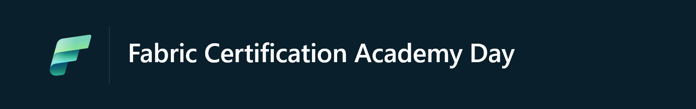

# Thank You for attending "Fabric Certification Academy Day"!

We're delighted you joined us for the Fabric Certification Academy DAy. Below, you'll find a treasure trove of resources to further your learning and engagement with Microsoft Fabric.

> [!IMPORTANT]  
> We're compiling all the resources and slides for this day. Please check later next week for more resources.

## Slides

[Download the slides](./assets/fabric-cert-academy-day-banner.png)

## Exam resources

- [Practice test](Aka.ms/dp600-practice)
- [Exam sandbox](https://go.microsoft.com/fwlink/?linkid=2226877)
- [Exam Readiness Zone](https://learn.microsoft.com/en-us/shows/exam-readiness-zone/preparing-for-dp-600-plan-implement-and-manage-a-solution-for-data-analytics)

## Dive Deeper into Microsoft Fabric

### 🟩 Easy Learning with [Fabric Notes](https://aka.ms/fabricnotes)

Unlock the power of Microsoft Fabric with engaging, easy-to-understand illustrations. Perfect for all levels of expertise!

[Access Fabric Notes Here](https://aka.ms/fabricnotes)

### 👩‍💻 Microsoft Fabric Career Hub

The one-stop location to begin your learning journey for the [DP-600: Implementing Analytics Solutions Using Microsoft Fabric certification](https://learn.microsoft.com/en-us/credentials/certifications/exams/dp-600/).

[Microsoft Fabric Career Hub on the Fabric Community Site](https://aka.ms/FabricCareerHub?ocid=fabric24_careerhub_blog_cxa)

> 🎓 **Special Offer:** Secure a **50% discount voucher for the Microsoft Fabric Exam** by completing the [Microsoft Fabric Cloud Skills Challenge](https://aka.ms/fabric30dtli) between January and June 2024.

### 🌟 Microsoft Fabric Learn Together

Join us for expert-guided live sessions! These will cover all necessary modules to ace the DP-600 exam and achieve the Fabric Analytics Engineer Associate certification. Offering 9 episodes, catered to both India and Americas time zones.

[Explore Learn Together Sessions](https://learn.microsoft.com/shows/learn-live/microsoft-fabric-wave-1/)

### 📖 Hands-On Learning with Fabric

Enhance your skills with over 30 interactive, on-demand learning modules tailored for Microsoft Fabric.

[Start Your Learning Journey](https://learn.microsoft.com/training/browse/?products=fabric)

### ☁️ Microsoft AI Tour Cloud Skills Challenge

Microsoft Learn helps you discover the tools and enhance your skills as an AI engineer, Data Analyst, Data Engineer, Data Scientist, and Developer. Develop your skills with five AI-themed challenges. Complete a challenge within 30 days of starting for a chance to earn a 50% discount on a Microsoft Certification exam.

[Start Your Learning Journey](https://learn.microsoft.com/en-us/collections/kxqae021m5j5m?wt.mc_id=aitour_advocacydeck_devcollection_cnl)

## 💬 Join the Microsoft Fabric Community

Connect with fellow Fabric enthusiasts and experts. Your one-stop community hub: https://community.fabric.microsoft.com/. Here's what you'll find:

- Interactive forums, like the [Synapse Forum](https://community.fabric.microsoft.com/t5/Synapse-forums/ct-p/AC-Community).
- A global directory of [Fabric User Groups](https://community.fabric.microsoft.com/t5/Fabric-User-Groups/ct-p/fbc_usergroups).
- The [Ideas Platform](https://ideas.fabric.microsoft.com/) for sharing and voting on product feedback.
- Stay updated with the [Official Updates Blog](https://blog.fabric.microsoft.com/blog/).

## ⏭️ Stay Ahead: The Future of Microsoft Fabric

Be in the know with the latest developments and upcoming features. Check out the public roadmap at https://aka.ms/FabricRoadmap
